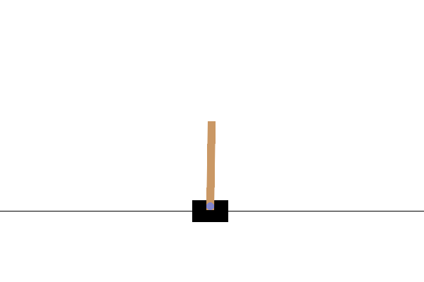

# PPO From Scratch

A full Proximal Policy Optimization (PPO) implementation built entirely from scratch in PyTorch.

This project implements a complete on-policy reinforcement learning pipeline including:

* Clipped surrogate objective
* Generalized Advantage Estimation (GAE)
* Rollout-based trajectory collection
* Mini-batch stochastic gradient updates
* Entropy regularization
* Optional KL-divergence monitoring

Verified on:

CartPole-v1

---

# 🚀 Project Overview

This repository demonstrates a clean and minimal PPO implementation without relying on high-level RL libraries such as Stable-Baselines3.

The goal is to clearly expose:

* How PPO collects trajectories
* How GAE is computed
* How clipped policy updates work
* How value function regression is performed
* How rollout size affects convergence

---

# 📂 Project Structure

```
ppo-from-scratch/
│
├── ppo/
│   ├── __init__.py
│   ├── agent.py        # PPO algorithm implementation
│   ├── memory.py       # Rollout buffer & GAE computation
│   └── model.py        # Actor & Critic neural networks
│
├── train.py            # Training pipeline (generates reward, actor loss, and critic loss curves)
├── play.py             # Evaluation & visualization
├── requirements.txt
├── LICENSE
└── README.md
```

---

# 🧠 Algorithm Details

This implementation follows the original PPO paper:

Clipped objective:

$$
L^{\text{CLIP}}(\theta) = \mathbb{E}_t \left[ \min \left( r_t(\theta) A_t, \text{clip}\big(r_t(\theta), 1-\epsilon, 1+\epsilon\big) A_t \right) \right]
$$

Key components implemented:

### 1️⃣ Generalized Advantage Estimation (GAE)

* γ = 0.99
* λ = 0.95
* Advantage normalization applied

### 2️⃣ Rollout Collection

* Fixed number of environment interaction steps
* On-policy data only
* Memory cleared after each update

### 3️⃣ Mini-batch Updates

* Multiple update epochs per rollout
* Shuffled mini-batch SGD
* Separate actor & critic losses

### 4️⃣ Stability Mechanisms

* Clipping (ε = 0.2)
* Entropy bonus
* Optional KL monitoring

---

# ⚙️ Installation

```
git clone https://github.com/flgkd/ppo-from-scratch.git
cd ppo-from-scratch
pip install -r requirements.txt
```

---

# 🏋️ Training

```
python train.py
```

The following hyperparameters are used for training PPO on CartPole-v1:

```
# PPO core
clip_epsilon           = 0.2
ppo_epochs             = 4
target_kl              = 0.01

# Rollout
rollout_steps          = 512
max_episodes           = 500

# GAE
gamma                  = 0.99
gae_lambda             = 0.95

# Optimization
actor_learning_rate    = 3e-4
critic_learning_rate   = 1e-3
mini_batch_size        = 64

# Regularization
entropy_coefficient    = 0.001

# Network architecture
hidden_size            = 64
```

Expected result:

* Converges to reward ≈ 500
* Stable policy behavior
* Smooth critic loss

---
# 📈 Results

Training was conducted on
CartPole-v1
using the PPO implementation in this repository.


## Episode Reward

The agent reaches the maximum reward (500) and maintains stable performance.

## Actor & Critic Loss

* Actor loss stabilizes as the policy converges.

* Critic loss decreases as value estimation improves.

---

# 🎮 Evaluation

To run a trained agent with rendering:

```
python play.py
```

This will:

* Load saved actor & critic weights
* Run deterministic policy (argmax)
* Open environment window
* Display live gameplay

<div align="center">
  
</div>

---

# 📊 Example Training Behavior

Typical learning curve characteristics:

* Rapid improvement in first 50–100 episodes
* Stable convergence near maximum reward
* Decreasing critic loss
* Actor loss oscillating near zero (expected)

---

# 🧪 Design Decisions

### Why fixed rollout instead of per-episode update?

Fixed rollouts:

* Improve batch stability
* Better approximate PPO paper setup
* Separate episode boundary from update boundary

For small environments like CartPole, smaller rollout sizes (e.g., 256–512) yield faster convergence.

---
# 🎯 Key Insights Learned

Through hands-on experimentation while implementing PPO from scratch on CartPole-v1, the following practical insights became very clear:

* **Increasing PPO epochs significantly accelerates convergence.**<br>
  Performing multiple optimization passes per rollout dramatically improves sample efficiency, especially in low-variance environments like CartPole.

* **The entropy coefficient has a large impact on learning behavior.**<br>
  Even small changes in entropy regularization noticeably affect exploration, convergence speed, and final stability.

* **Rollout size strongly influences convergence dynamics.**<br>
  Larger rollouts provide more stable gradient estimates but may slow down policy updates. Smaller rollouts (e.g., 512 vs 2048) often lead to faster learning in short-episode environments.

---
# 📌 Future Extensions

* Continuous control (Gaussian policy)
* Parallel environments
* Atari benchmark
* Mujoco benchmark
* Learning rate scheduling per update
* TensorBoard integration

---

# 📜 License

MIT License

---

# 🎓 Educational Purpose

This repository is intended for learning and research purposes.

All components are implemented manually to illustrate how PPO works internally without abstraction layers.

---

# ⭐ If you found this useful

Feel free to star the repository.


